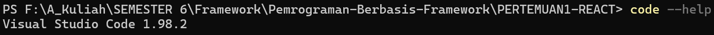
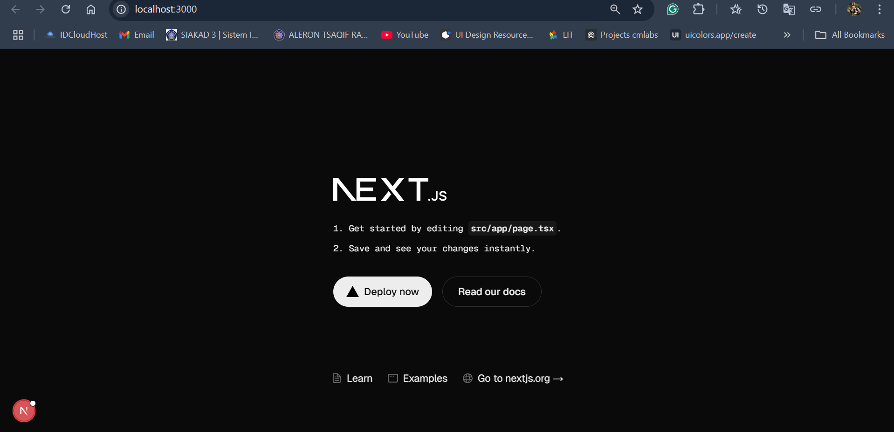

# Pertemuan 1 - Pemrograman Framework

Pada pertemuan pertama melakukan pengenalan dasar terhadap framework Next.js

## Praktikum 1

Pada praktikum pertama, kami diminta untuk menginstall segala keperluan untuk menunjuang mata kuliah ini selama satu semester, diantaranya Git, VS Code dan NodeJS.

### Pertanyaan Praktikum 1

1. Jelaskan kegunaan masing-masing Git, VS Code dan NodeJS yang telah diinstall

   - Git, merupakan _source code management_ yang dapat membantu mengelola proyek secara efisien, termasuk riwayat perubahan kode, fitur _branching_ dan _merging_ serta memungkinkan kolaborasi tim.
   - VS Code, adalah salah satu editor kode yang mendukung berbagai bahasa dan teknologi serta ekstensi untuk berbagai bahasa pemrograman yang dapat membantu pengembang dalam mengembangkan kode proyek.
   - NodeJS, adalah **runtime JavaScript** yang dapat memungkinkan menjalankan JavaScript di luar browser.

2. Screenshot sebagai bukti bahwa masing-masing tools telah terinstall pada perangkat

#### Git

#### VS Code

#### NodeJS

## Praktikum 2

Pada praktikum 2, kami melakukan percobaan membuat proyek pertama menggunakan **Next.js**. Proyek dibuat melalui terminal dengan command `npx create-next-app`

Proyek aplikasi yang dibuat dapat langsung dijalankan pada localhost browser dengan command `npm run dev` pada terminal.

### Pertanyaan Praktikum 2

1. Pada Langkah ke-2, setelah membuat proyek baru menggunakan Next.js, terdapat beberapa
   istilah yang muncul.
   - TypeScript, adalah **superset** dari **JavaScript** untuk membantu deteksi kesalahan sebelum runtime, keterbacaan kode
   - ESLint, merupakan alat untuk menjaga kualitas kode dengan memberikan peringatan ketika kode memiliki kesalahan
   - Tailwind CSS, framework CSS untuk mendesain halaman langsung dalam class HTML
   - App Router, merupakan routing baru di Next.js versi 13 ke atas yang berbasis pada folder `app/`, berbeda dengan versi lama yaitu `pages/`
   - Import alias, untuk penulisan path yang lebih ringkas saat mengimpor file atau komponan
   - Turbopack, bundler baru pengganti Webpack yang dikatakan memiliki proses build lebih cepat.
2. Apa saja kegunaan folder dan file yang ada pada struktur proyek React yang tampil pada
   gambar pada tahap percobaan ke-3!
   - **src/app/** merupakan folder utama untuk App Router dan berisi halaman serta layout aplikasi
   - **public/** merupakan folder untuk menyimpan aset statis
   - **components/** digunakan untuk menyimpan komponen reusable seperti button, navbar, card, dll
   - **styles/** untuk menyimpan file CSS
   - **lib/** merupakan folder untuk menyimpan kode helper fetch API
   - **next.config.js** merupakan sebuah file konfigurasi Next.js
   - **package.json** adalah file yang menyimpan informasi tentang proyek, dependencies dan script
3. Buktikan dengan screenshoot yang menunjukkan bahwa tahapan percobaan di atas telah
   berhasil Anda lakukan!
   

## Praktikum 3

Pada praktikum ini kami akan menambahkan **Button** untuk ditampilkan pada halaman utama Next.js

### Pertanyaan Praktikum 3

Menunjukkan keberhasilan dari praktikum 3

## Praktikum 4

Pada praktikum ini kami menambahkan **Nama dan Profil** untuk ditampilkan pada halaman utama Next.js

### Pertanyaan Praktikum 4

1. Untuk apakah kegunaan sintaks user.imageUrl?
   sintaks tersebut akan mengarahkan ke alamat tujuan yang digunakan sebagai foto profile
2. Menunjukkan keberhasilan dari praktikum 4
   
