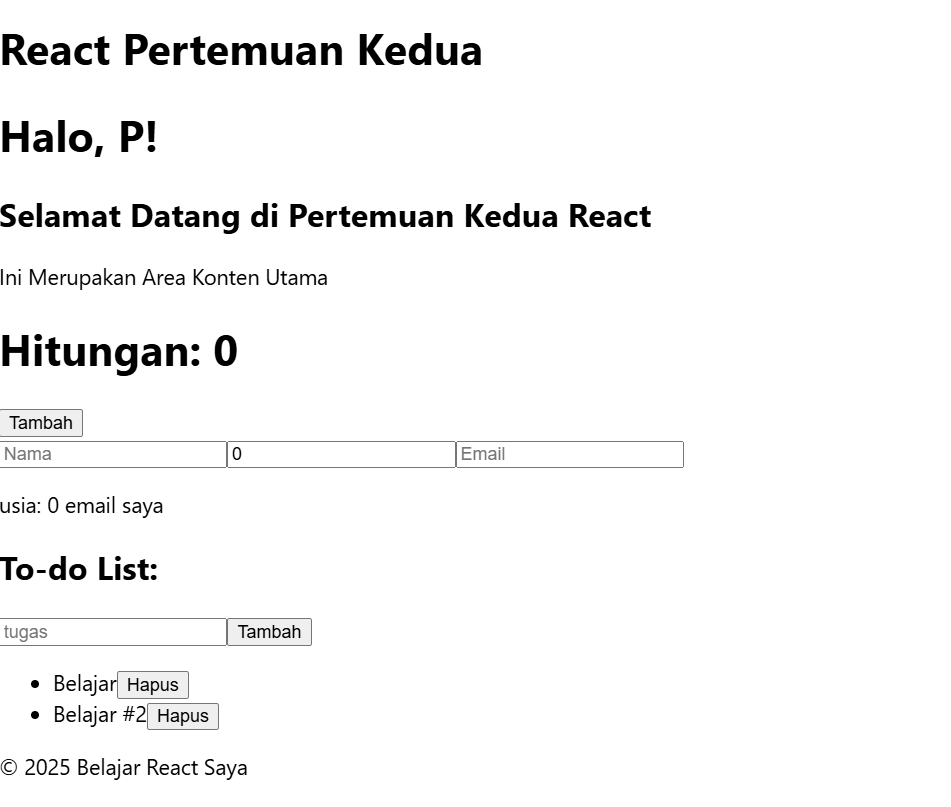

# Pertemuan 2 React

Pada pertemuan kedua ini, kami mempelajari dasar-dasar React, termasuk dalam pembuatan komponen, penggunaan JSX, props, dan state. serta membangun aplikasi sederhana menggunakan konsep dasar tersebut.

#### Code:

```js
import React, { useState } from "react";
import Counter from "./Counter";
import Greeting from "./Greetings";
import TodoList from "./Do_list";
// komponen dasar
function Header() {
  return (
    <header>
      <h1>React Pertemuan Kedua</h1>
    </header>
  );
}

function Main() {
  return (
    <main>
      <h2>Selamat Datang di Pertemuan Kedua React</h2>
      <p>Ini Merupakan Area Konten Utama</p>
    </main>
  );
}

function Footer() {
  return (
    <footer>
      <p>&copy; 2025 Belajar React Saya</p>
    </footer>
  );
}

function Example() {
  const [name, setName] = useState("");
  const [age, setAge] = useState(0);
  const [email, setEmail] = useState("");

  const handleNameChange = (e) => {
    setName(e.target.value);
  };

  const handleAgeChange = (e) => {
    setAge(e.target.value);
  };

  const handleEmailChange = (e) => {
    setEmail(e.target.value);
  };

  return (
    <div>
      <input
        type="text"
        placeholder="Nama"
        value={name}
        onChange={handleNameChange}
      ></input>
      <input
        type="number"
        placeholder="Umur"
        value={age}
        onChange={handleAgeChange}
      ></input>
      <input
        type="emai"
        placeholder="Email"
        value={email}
        onChange={handleEmailChange}
      ></input>

      <p>
        {name} usia: {age} email saya {email}
      </p>
    </div>
  );
}

function App() {
  return (
    <div>
      <Header />
      <Greeting name="P" />
      <Main />
      <Counter />
      <Example />
      <TodoList />
      <Footer />
    </div>
  );
}

export default App;
```

#### Hasil


