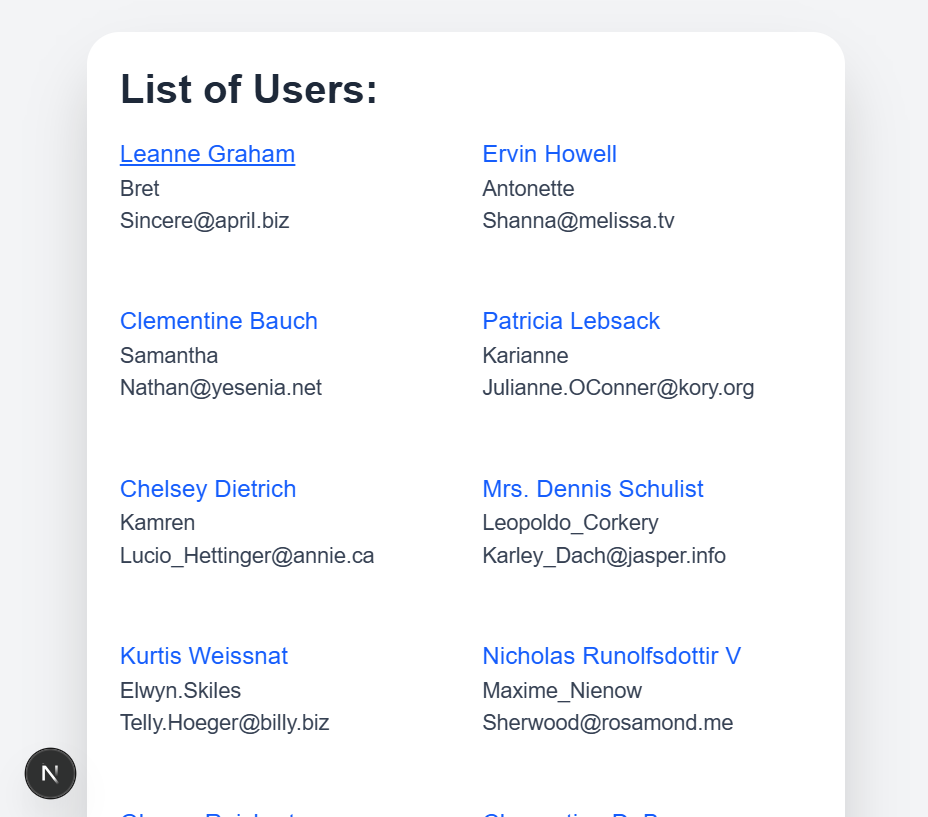
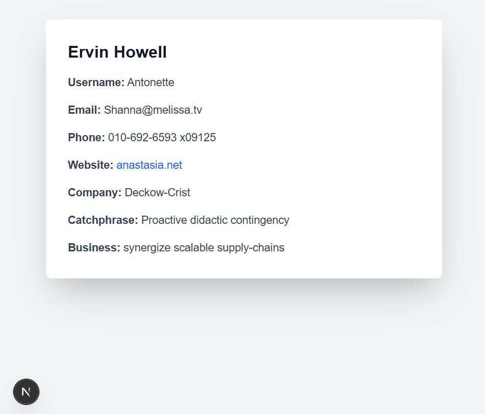
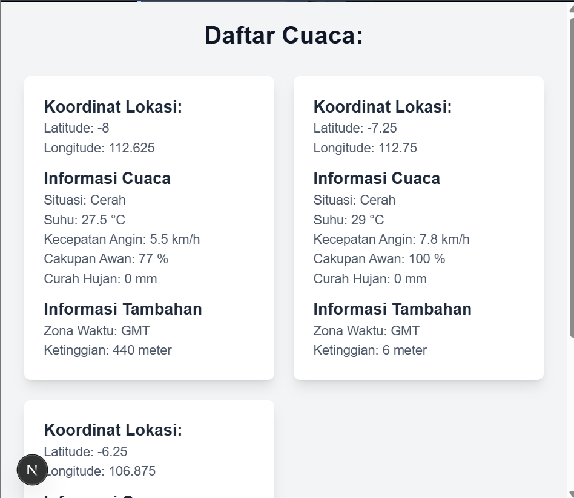

# Pertemuan 3 - Pengenalan Next.js

Pertemuan ini memiliki tujuan agar kami dapat memahami:

- Konsep dasar Next.js dan beberapa fitur-fitur yang dimilikinya.
- Mampu mengaplikasikan server-side rendering (SSR) dan static site generation (SSG) pada aplikasi web.
- Penggunaan routing, API routes dan optimasi gambar di Next.js
- Membangun aplikasi web yang dinamis dan kompleks dengan Next.js

## Tugas

1. Membuat halaman baru dengan menggunakan **Static Site Generation (SSG)** yang menampilkan daftar pengguna dari API [https://jsonplaceholder.typicode.com/users](https://jsonplaceholder.typicode.com/users).

#### Code:

```js
import React from "react";
import Link from "next/link";

const Multiple = ({ users, posts }) => {
  return (
    <div className="min-h-screen text-gray-700 bg-gray-100 flex items-center justify-center">
      <div className="p-6 max-w-xl mx-7 my-6 bg-white shadow-2xl rounded-3xl">
        <h1 className="text-3xl text-gray-800 font-bold mb-4">
          List of Users:
        </h1>
        <ul className="grid grid-cols-2 sm:grid-cols-2 gap-6">
          {users.map((user) => (
            <li key={user.id}>
              <Link href={`/user/${user.id}`}>
                <p className="text-lg text-blue-600 hover:underline">
                  {user.name}
                </p>
              </Link>
              <p>{user.username}</p>
              <p>{user.email}</p>
              <br />
            </li>
          ))}
        </ul>
        <br />
        <h1 className="text-3xl text-gray-800 font-bold mb-4">POSTS LIST:</h1>
        <ul>
          {posts.map((post) => (
            <li key={post.id}>
              <p>{post.title}</p>
              <br />
            </li>
          ))}
        </ul>
      </div>
    </div>
  );
};

export async function getStaticProps() {
  const resUser = await fetch("https://jsonplaceholder.typicode.com/users");
  const resPost = await fetch("https://jsonplaceholder.typicode.com/posts");
  const users = await resUser.json();
  const posts = await resPost.json();

  return {
    props: {
      users,
      posts: posts.slice(0, 5),
    },
  };
}

export default Multiple;
```

#### Hasil:



2. Mengimplementasikan **Dynamic Routes** untuk menampilkan detail pengguna berdasarkan ID

#### Code:

```js
import { useRouter } from "next/router";

const UserDetail = ({ user }) => {
  const router = useRouter();

  if (router.isFallback) {
    return <p>Memuat mohon tunggu...</p>;
  }

  return (
    <div className="min-h-screen bg-gray-100 py-8 px-4">
      <div className="w-full sm:max-w-xl md:max-w-2xl lg:max-w-4xl mx-auto bg-white shadow-2xl rounded-lg overflow-hidden">
        <div className="p-6 sm:p-8">
          <h1 className="text-xl sm:text-2xl md:text-3xl font-bold text-gray-900 mb-4">
            {user.name}
          </h1>
          <div className="space-y-4">
            <p className="text-gray-700">
              <span className="font-semibold">Username:</span> {user.username}
            </p>
            <p className="text-gray-700">
              <span className="font-semibold">Email:</span> {user.email}
            </p>
            <p className="text-gray-700">
              <span className="font-semibold">Phone:</span> {user.phone}
            </p>
            <p className="text-gray-700">
              <span className="font-semibold">Website:</span>{" "}
              <a
                href={`http://${user.website}`}
                className="text-blue-600 hover:underline"
                target="_blank"
                rel="noopener noreferrer"
              >
                {user.website}
              </a>
            </p>
            <p className="text-gray-700">
              <span className="font-semibold">Company:</span>{" "}
              {user.company.name}
            </p>
            <p className="text-gray-700">
              <span className="font-semibold">Catchphrase:</span>{" "}
              {user.company.catchPhrase}
            </p>
            <p className="text-gray-700">
              <span className="font-semibold">Business:</span> {user.company.bs}
            </p>
          </div>
        </div>
      </div>
    </div>
  );
};

export async function getStaticPaths() {
  const resUser = await fetch("https://jsonplaceholder.typicode.com/users");
  const users = await resUser.json();

  const paths = users.map((user) => ({
    params: { id: user.id.toString() },
  }));

  return {
    paths,
    fallback: true,
  };
}

export async function getStaticProps({ params }) {
  const resUser = await fetch(
    `https://jsonplaceholder.typicode.com/users/${params.id}`
  );
  if (!resUser.ok) {
    return {
      notFound: true,
    };
  }
  const user = await resUser.json();

  return {
    props: {
      user,
    },
    revalidate: 60,
  };
}

export default UserDetail;
```

#### Hasil:



3. Membuat **API route** yang dapat mengembalikan data cuaca dari API eksternal dan ditampilkan pada halaman front-end. Disini saya menggunakan API dari [open-meteo.com](https://open-meteo.com)

#### Code /pages/api/weather.js :

```js
export default async function handler(req, res) {
  const response = await fetch(
    "https://api.open-meteo.com/v1/forecast?latitude=-7.983908,-7.250445,-6.2&longitude=112.621391,112.768845,106.816666&current=temperature_2m,is_day,rain,cloud_cover,wind_speed_10m"
  );
  const weather = await response.json();

  res.status(200).json(weather);
}
```

#### Code /pages/weather.js :

```js
import { useState, useEffect } from "react";

const WeatherList = () => {
  const [weather, setWeather] = useState([]);

  useEffect(() => {
    const fetchWeather = async () => {
      const response = await fetch("api/weather");
      const weather = await response.json();
      setWeather(weather);
    };

    fetchWeather();
  }, []);

  return (
    <div className="min-h-screen bg-gray-100 pb-8 px-4">
      <h1 className="text-3xl font-bold text-gray-900 text-center pt-6 mb-8">
        Daftar Cuaca:
      </h1>
      <ul className="grid grid-cols-2 space-y-6">
        {weather.map((cuaca) => (
          <li
            key={cuaca.location_id}
            className="w-auto bg-white shadow-lg rounded-lg p-6 mx-3 space-y-3"
          >
            <div className="space-y-4">
              <div>
                <h2 className="text-xl font-semibold text-gray-800">
                  Koordinat Lokasi:
                </h2>
                <div className="text-gray-600">
                  <p>Latitude: {cuaca.latitude}</p>
                  <p>Longitude: {cuaca.longitude}</p>
                </div>
              </div>
            </div>
            <div>
              <h2 className="text-xl font-semibold text-gray-800">
                Informasi Cuaca
              </h2>
              <div className="text-gray-600 font-medium">
                <p>
                  <span>Situasi:</span>{" "}
                  {cuaca.current.is_day === 1 ? "Cerah" : "Gelap"}
                </p>
                <p>
                  <span>Suhu:</span> {cuaca.current.temperature_2m}{" "}
                  {cuaca.current_units.temperature_2m}
                </p>
                <p>
                  <span>Kecepatan Angin: </span>
                  {cuaca.current.wind_speed_10m} {cuaca.current_units.wind_speed_10m}
                </p>
                <p>
                  <span>Cakupan Awan: </span>
                  {cuaca.current.cloud_cover} {cuaca.current_units.cloud_cover}
                </p>
                <p>
                  <span>Curah Hujan: </span>
                  {cuaca.current.rain} {cuaca.current_units.rain}
                </p>
              </div>
            </div>
            <div>
              <h2 className="text-xl font-semibold text-gray-800">
                Informasi Tambahan
              </h2>
              <div className="text-gray-600 font-medium">
                <p>
                  <span>Zona Waktu: </span> {cuaca.timezone}
                </p>
                <p>
                  <span>Ketinggian: </span> {cuaca.elevation} meter
                </p>
              </div>
            </div>
          </li>
        ))}
      </ul>
    </div>
  );
};

export default WeatherList;
```

#### Hasil:


