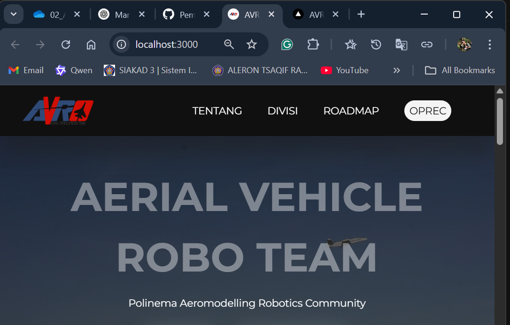
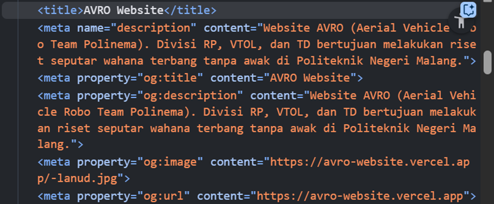

# PERTEMUAN 10 Penerapan SEO pada Website

Pada pertemuan ini memiliki tujuan untuk mengoptimalkan website agar mudah ditemukan oleh mesin pencari seperti Google. Dengan SEO yang baik, website Anda akan lebih mudah muncul di hasil pencarian, sehingga meningkatkan traffic pengunjung.

## Langkah 1 - Memahami SEO

SEO (Search Engine Optimization) adalah praktik mengoptimalkan website agar mudah ditemukan oleh mesin pencari seperti Google. Dengan SEO yang baik, website Anda akan lebih mudah muncul di hasil pencarian, sehingga meningkatkan traffic pengunjung.
Beberapa elemen penting dalam SEO:
- Title Tag: Judul halaman yang muncul di hasil pencarian.
- Meta Description: Deskripsi singkat tentang halaman.
- Heading Tags (H1, H2, dll.): Struktur konten yang membantu mesin pencari memahami isi halaman.
- URL Structure: URL yang deskriptif dan mudah dibaca.
- Open Graph Tags: Metadata untuk media sosial seperti Facebook dan Twitter.
- Favicon: Ikon kecil yang muncul di tab browser.

## Langkah 2 - Menambahkan Favicon

Favicon adalah ikon kecil yang muncul di tab browser dan bookmark. Favicon berfungsi sebagai pemberi identitas pada website yang dibuat.

1.  Menyiapkan file favicon (format .ico) dan letakkan di folder public/.


2.  Hapus favicon.ico yang ada di folder src/app

3.  Update file src/components/layout.tsx untuk menambahkan favicon

#### Code layout.tsx bagian favicon:
```tsx
return (
    <html lang="en">
      <head>
        <link rel="icon" href="/favicon.ico" />
      <head/>
    <html/>
);
```
#### Hasil:


## Langkah 3 - Menambah Metadata

1.  Buat file src/utils/metadata.ts untuk menyimpan metadata default:
#### Code metadata.ts:
```tsx
export default function RootLayout({children}: {children: React.ReactNode}) {
  // const metadata = children.props.metadata || defaultMetadata;

  return (
    <html lang="en">
      <head>
        <link rel="icon" href="/favicon.ico" />
        <title>{defaultMetadata.title}</title>
        <meta name="google-site-verification" content="RLhIWrs0igN11cu7bsgv7J6pLD1PE7hgphtKMEfCwW4" />
        <meta name="description" content={defaultMetadata.description}/>
        <meta property="og:title" content={defaultMetadata.title}/>
        <meta property="og:description" content={defaultMetadata.description}/>
        <meta property="og:image" content={defaultMetadata.openGraph.images}/>
        <meta property="og:url" content={defaultMetadata.openGraph.url}/>
      </head>
      <body className={`${montserrat.variable} bg-dark text-light`}>
        {children}
      </body>
    </html>
  );
}
```
2.  Update file src/components/layout.tsx untuk menggunakan metadata default jika tidak ada metadata yang di-pass:
#### Code layout.tsx dengan metadata:
```tsx
export default function RootLayout({children}: {children: React.ReactNode}) {
  // const metadata = children.props.metadata || defaultMetadata;

  return (
    <html lang="en">
      <head>
        <link rel="icon" href="/favicon.ico" />
        <title>{defaultMetadata.title}</title>
        <meta name="google-site-verification" content="RLhIWrs0igN11cu7bsgv7J6pLD1PE7hgphtKMEfCwW4" />
        <meta name="description" content={defaultMetadata.description}/>
        <meta property="og:title" content={defaultMetadata.title}/>
        <meta property="og:description" content={defaultMetadata.description}/>
        <meta property="og:image" content={defaultMetadata.openGraph.images}/>
        <meta property="og:url" content={defaultMetadata.openGraph.url}/>
      </head>
      <body className={`${montserrat.variable} bg-dark text-light`}>
        {children}
      </body>
    </html>
  );
}
```
*Bagian saya berbeda dengan praktikum pada param dalam export default function karena 'any' menyebabkan error saat deploy ke Vercel*

## Langkah 4 - OpenGraph untuk Media Sosial

Langkah ini sudah dilakukan sesuai dengan langkah 3 dalam menambah metadata.

## Langkah 5 - Menguji SEO

Setelah menambahkan metadata, favicon, dan Open Graph Tags, Anda dapat menguji SEO dengan Membuka halaman di browser dan memeriksa elemen HTML menggunakan Developer Tools (Ctrl + Shift + I atau F12).
